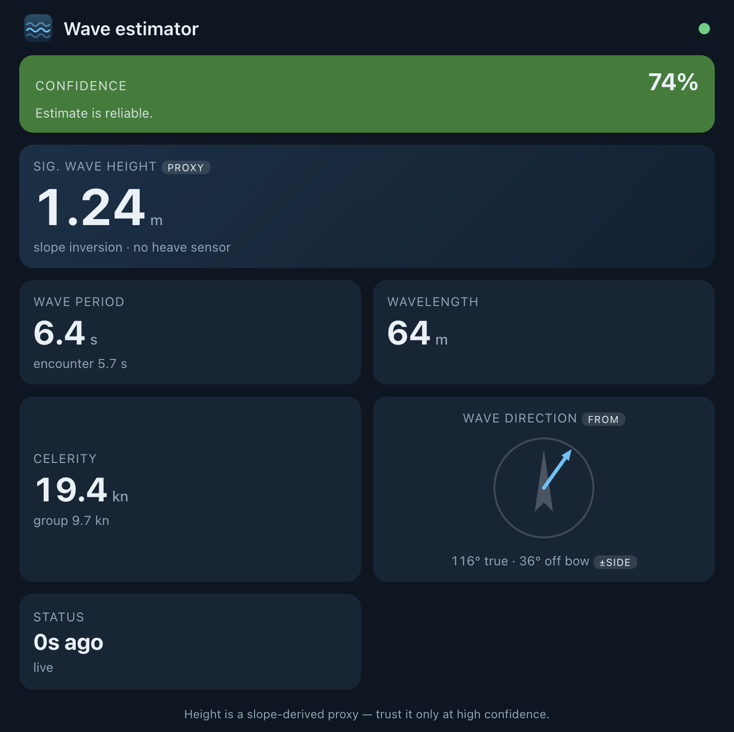

# signalk-wave-estimator

Derive sea state from boat motion. The plugin watches `navigation.attitude`
(pitch/roll) plus `navigation.speedThroughWater`, estimates the dominant wave
**encounter period** by FFT of the pitch oscillation, corrects it for boat speed
using the deep-water encounter relation, and publishes true wave period,
wavelength, celerity and a **height proxy** under `environment.wave.*`.



> **Alpha — not yet sea-trialled.** All verification so far is synthetic (the
> `npm test` sanity check) plus dockside running; the estimator has **not** been
> validated against real waves or a known sea state, and the height proxy is
> **uncalibrated**. Period / wavelength / celerity are well-posed. Wave **height
> is a proxy**, not a measurement — there is no heave/vertical-acceleration
> sensor on the bus, so height is inferred from wave *slope* and carries a
> confidence value. Trust it only when confidence is high. See *Height* below.

## Why height is only a proxy

Pitch and roll follow the wave **slope**, not the surface elevation. For a wave
`η = a·cos(kx − ωt)` the slope amplitude is `a·k`, so

```
height H = 2a ≈ slope · λ / π          (single dominant wave)
```

i.e. recovering height from slope needs the **wavelength**, which the plugin
computes from the period. Spectrally, the slope-variance spectrum equals
`k²` × the elevation-variance spectrum, so the significant-height analogue is

```
Hs = 4·σ_elev = 4·√(m0_pitch + m0_roll) / k
```

with `m0` the in-band slope variance and `k` the dominant wavenumber. This is a
**narrowband** inversion (one `k` applied across the band) and assumes the hull
*contours* the wave — valid only when the wavelength clearly exceeds the
waterline length. A real, calibration-free height would need double-integrated
heave acceleration from an MRU/IMU. (Full background and the algorithm survey are
in the project HANDOFF notes.)

### When to believe the height

| Condition | Height quality |
|---|---|
| Wavelength ≫ hull (λ ≳ 3·LWL), head/following seas, sharp spectral peak | usable proxy |
| Wavelength ≈ hull, or confused/short chop | unreliable — confidence drops |
| Beam seas (roll-dominated) | poor — roll resonance inflates the slope; confidence drops |

The published `environment.wave.confidence` (0–1) folds in wavelength-vs-hull,
spectral sharpness, encounter-solve validity and roll dominance. Estimates below
**Minimum confidence** are suppressed rather than published as noise.

## Path to a measured height (future: heave sensor)

The proxy exists only because nothing on the bus reports vertical motion: the
Raymarine EV-1 puts attitude (PGN 127257) on N2K but **not** heave (PGN 127252),
and there is no MRU aboard. A measured significant height needs a source of
**vertical acceleration in the earth frame** — published as `environment.heave`
(m, an `environment` path, not `navigation.attitude`), or as raw vertical
acceleration the plugin integrates itself.

The practical candidate is a low-cost 9-DoF IMU with on-chip fusion, e.g. a
**BNO085** (the BNO055 is legacy). Notes for an on-board fit:

- **Interface — UART, not I²C.** Both Bosch BNO0xx parts use I²C clock
  stretching, which the Raspberry Pi's hardware I²C cannot handle reliably (you
  get dropped/corrupt reads). Use a Pi UART, or a small ESP32 + SensESP node that
  publishes deltas over Wi-Fi/N2K.
- **Mounting — placement matters, orientation does not.** Mount it near the
  vessel's centre of motion (low, central) so rotation-induced acceleration
  (`r × ω̇` + centripetal) does not leak into heave. Orientation is *free* for
  heave alone: the fusion tracks "down" itself, so the vertical component is
  recovered however the chip is turned — it only has to be rigidly fixed. No
  magnetometer calibration is needed (gravity + gyro suffice; the magnetometer
  only fixes heading), which sidesteps the usual hard/soft-iron grief on board.
- **Plugin side — integrate in the frequency domain.** Rather than time-domain
  double integration (which drifts), take the acceleration PSD and **divide by
  (2πf)⁴** to get the elevation spectrum. The existing band limit
  (`fMin = 1/periodMax`) discards the low-frequency bins where integration would
  otherwise blow up. Height then becomes a true `Hs = 4·√(m0_heave)` — no `k`
  inversion, no narrowband assumption, no λ-vs-hull validity gate.

Until that hardware exists, the slope inversion below is the best available.

## Physics

Deep-water encounter relation, solved for the true angular frequency `ω`:

```
ω_e = ω − (ω²/g)·U·cos(μ)          measured ω_e, speed U, encounter angle μ
a·ω² − ω + ω_e = 0,  a = U·cos(μ)/g
ω = (1 − √(1 − 4·a·ω_e)) / (2a)     physical root; ω → ω_e as a → 0
T = 2π/ω,  λ = g·T²/2π ≈ 1.56·T²,  c = g·T/2π,  c_g = c/2
```

Head seas (`cos μ < 0`) raise the encounter frequency (waves met more often);
following seas lower it and can be multi-valued. As the encounter frequency
approaches its maximum the two roots converge and the solve becomes
ill-conditioned (and beyond the maximum there is no real root at all). In both
cases the corrected period would be systematically wrong rather than merely
uncertain, so the plugin **withholds** the wave parameters for that cycle
(publishing only the heartbeat with `state: lowConfidence`) instead of emitting a
confident-looking but arbitrary value.

The encounter angle magnitude off the bow is estimated from the slope-energy
ratio `tan α = √(m0_roll / m0_pitch)`. Amplitude alone cannot resolve
head-vs-following or port-vs-starboard; wind direction (if available) picks the
head/following sign, otherwise the configured default regime is used. The
port/starboard side of `directionRelative` is left unresolved (would need the
roll/pitch phase relationship).

## Published paths (`environment.wave.*`, SI units)

| Path | Unit | Meaning |
|---|---|---|
| `period` | s | true wave period (speed-corrected) |
| `encounterPeriod` | s | measured encounter period (uncorrected) |
| `length` | m | wavelength |
| `celerity` | m/s | phase speed |
| `groupSpeed` | m/s | group speed (c/2) |
| `significantHeight` | m | **proxy** Hs from slope inversion |
| `directionTrue` | rad | direction waves come from (heading + relative) |
| `directionRelative` | rad | off-bow magnitude waves come from (side unresolved) |
| `confidence` | ratio | 0–1 estimate confidence |

`environment.wave.*` is not part of the formal Signal K spec but is the
conventional namespace (`significantHeight`, `period`, `direction`).

## Configuration

| Setting | Default | Notes |
|---|---|---|
| Analysis window (s) | 90 | FFT buffer length; longer = finer low-frequency resolution |
| Update interval (s) | 5 | how often an estimate is computed |
| Resample rate (Hz) | 4 | attitude is resampled to a uniform grid before the FFT |
| Shortest / longest period (s) | 2 / 20 | analysis band |
| Waterline length (m) | 8.4 | Elan 333 LWL; drives the confidence flag |
| Default sea regime | head | head/following sign when wind is unknown |
| Minimum confidence | 0.1 | suppress estimates below this |
| Minimum motion (° RMS slope) | 0.5 | amplitude gate; suppress when the boat barely moves (dock ≈ 0.04° RMS). 0 disables |

## Install / deploy on board

```bash
cd signalk-wave-estimator && npm install && npm link
cd ~/.signalk && npm link signalk-wave-estimator
# then restart signalk-server and enable the plugin
```

## Test

`npm test` runs a synthetic sanity check (no hardware): it builds pitch/roll
from a known wave and verifies the estimator recovers the period, wavelength and
the encounter-speed correction.

## Known limitations / TODO

- **Not yet sea-trialled.** No on-water validation against a known sea state;
  the height proxy is uncalibrated. This is the next step — calibrate against a
  sea-trial visual reference.
- Height is a slope-inversion proxy (no heave sensor) — see *Path to a measured
  height* for what a real one would take.
- Following-seas root ambiguity / ill-conditioning near the encounter-frequency
  maximum is handled by withholding the estimate, not by full resolution.
- `directionRelative` port/starboard side unresolved (needs roll/pitch phase).
- Narrowband height inversion biases broadband/confused seas.
- Optional shallow-water dispersion correction (`environment.depth`) not yet
  implemented; deep-water approximation only.
